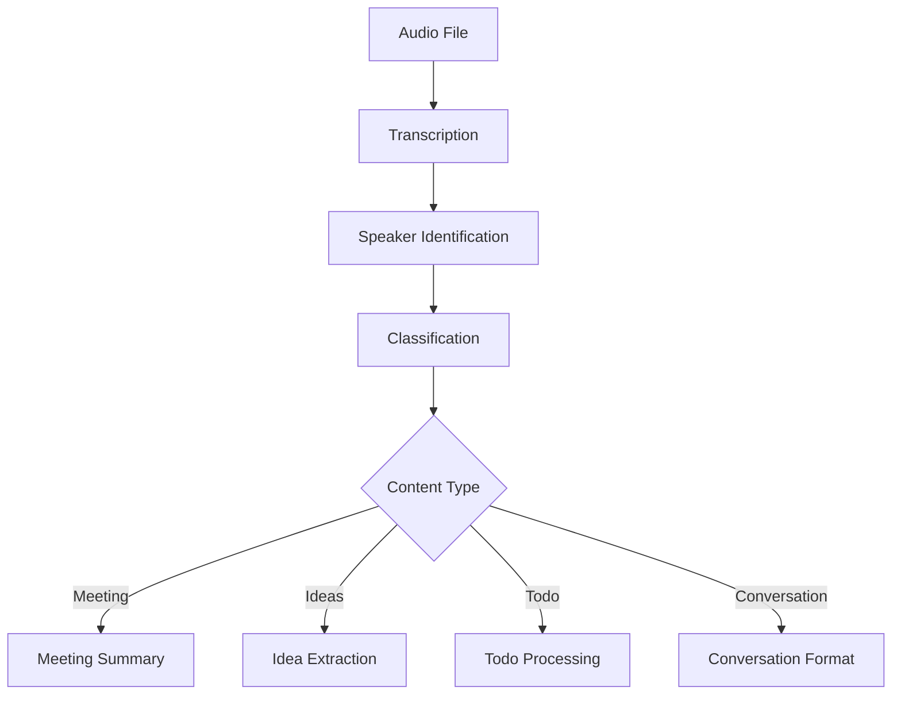

# AI-Enhanced Personal Knowledge System

A powerful Python framework that combines AI capabilities with personal knowledge management and automation. The system is built around a flexible AI engine that can process various types of content, with special integration for Obsidian and support for multiple external services.

## Key Features

- **AI Engine**: Flexible system for interacting with various AI models (Claude, GPT, etc.) with built-in support for tools and complex interactions
- **Obsidian Integration**: Seamlessly process and enhance your Obsidian vault content with AI capabilities
- **Content Processing Pipeline**: Automated processing of various content types:
  - Audio transcription and summarization
  - Meeting notes enhancement
  - Idea extraction and organization
  - Task management
  - Document processing (Google Docs, Markdown)
- **Interactive Tools**: Keyboard-triggered popup window for quick text processing and AI interactions
- **Extensible Toolsets**: Ready-to-use AI tools for various services (LinkedIn, Coda, etc.)
- **Automation Scripts**: Ready-to-use scripts for LinkedIn automation, bulk email sending, and more

## Use Cases

- Automatically transcribe and summarize meeting recordings
- Extract and organize ideas from voice notes
- Enhance your notes with AI-powered insights
- Process and improve text with customizable AI actions
- Integrate external services into your knowledge workflow
- Automate LinkedIn networking and data collection
- Send personalized bulk emails with templates
- Manage and track outreach campaigns

## AI Engine

The AI Engine is the core component that manages all AI model interactions. It provides a flexible and powerful interface for working with different AI models (like Claude and GPT) while adding sophisticated capabilities like tools, image handling, and conversation management.

### Key Features

- **Multiple Model Support**: Seamlessly work with different AI models through a unified interface
- **Tool System**: Powerful decorator-based system for creating AI-callable tools
- **Message Handling**: 
  - Support for text, images, and tool interactions
  - Conversation management with history tracking
  - Structured message types for different content
- **Debug Mode**: Built-in debugging capabilities for development and troubleshooting

### Basic Usage

```python
from ai import AI

# Initialize with a specific model
ai_model = AI("claude-3-sonnet")

# Simple text interaction
response = ai_model.message("Hello, how are you?")

# With system prompt
response = ai_model.message(
    "Analyze this text", 
    system_prompt="You are a text analysis expert"
)

# With image
response = ai_model.message(
    "What's in this image?",
    image_paths=["path/to/image.jpg"]
)
```

### Tool System

The AI Engine includes a powerful tool system that allows you to create AI-callable functions:

```python
from ai.tools import tool

@tool(
    description="Fetch weather data for a location",
    city="The city to get weather for",
    units="The temperature units to use"
)
def get_weather(
    city: str,
    units: Literal["celsius", "fahrenheit"] = "celsius"
) -> str:
    # Implementation here
    pass

# Use the tool with an AI model
ai_model = AI("claude-3-sonnet", tools=[get_weather])
```

### Advanced Features

- **Conversation Mode**: Maintain context across multiple interactions
```python
# Start a conversation
response = ai_model.conversation("Let's talk about AI")
response = ai_model.conversation("Tell me more")  # Maintains context
```

- **Memory System**: Built-in system for AI to maintain persistent memory
```python
# AI can store and retrieve information
ai_model = AI("claude-3-sonnet", tools=memory.TOOLS)
```

- **Custom Tool Sets**: Pre-built tool collections for various integrations
  - Coda integration for document and table management
  - Memory management for persistent AI knowledge
  - Obsidian integration for note processing

## Obsidian Integration

The Obsidian integration provides a powerful way to enhance your Obsidian vault with AI capabilities. It watches for changes in your vault files and processes special AI tags to generate responses, modify content, and interact with various tools.

### Key Features

- **File Watching**: Automatically detects changes in your Obsidian vault
- **Custom AI Tags**: Process special tags in your markdown files:
  - `<ai!>content</ai!>`: Basic AI interaction
  - `<ai!value>content</ai!>`: Advanced options for file modifications
  - Support for custom parameters and system prompts
- **Context Awareness**: 
  - Understands vault structure and relationships
  - Can process frontmatter
  - Maintains conversation context within notes
- **Safe Tool Execution**: Built-in confirmation system for potentially destructive operations

### Basic Usage

Add AI capabilities to your notes using tags:

```markdown
<ai!>
What are the key points in this note?
</ai!>
```

### Advanced Options

Customize AI behavior with parameters:

```markdown
<ai!> <model!sonnet3.5> <temperature!0.7>
<system!expert_analysis>
Please analyze this technical document.
</ai!>
```

### Special Commands

- `<model!model_name>`: Specify different AI models
- `<system!prompt_name>`: Use custom system prompts from prompts directory
- `<temperature!value>`: Set the temperature for AI responses
- `<max_tokens!value>`: Set maximum tokens for response
- `<tools!toolset>`: Enable specific tool sets
- `<debug!>`: Enable debug mode to see parameter and conversion details
- `<this!>`: Reference the current document
- `<repo!path>`: Include repository context
- `<vault!>`: Include entire vault context
- `<meeting!path>`: Reference meeting transcription
- `<transcription!path>`: Reference any transcription
- `<daily!path>`: Reference daily note
- `<idea!path>`: Reference idea transcription
- `<unsorted!path>`: Reference unsorted transcription
- `<doc!path>`: Reference any document
- `<pdf!path>`: Reference PDF document
- `<md!path>`: Reference downloaded markdown
- `<file!path>`: Reference any file
- `<prompt!path>`: Include system prompt from prompts directory

### File Processing

The integration automatically:
- Watches for file changes in your vault
- Processes AI tags when files are modified
- Updates content based on AI responses
- Maintains proper markdown formatting
- Preserves frontmatter and note structure

### Configuration

Key settings in `obsidian_ai.py`:
- `VAULT_PATH`: Path to your Obsidian vault
- `VAULT_EXCLUDE`: Folders to exclude from processing
- `DEFAULT_LLM`: Default AI model to use
- `SEARCH_PATHS`: Additional paths for context

## Processing Pipeline

The system includes a powerful processing pipeline that automatically handles various types of content through multiple stages. Each processor is specialized for specific tasks and can be chained together to form complex workflows.

### Core Features

- **Base Processor Framework**: Extensible system for creating content processors
- **Stage-Based Processing**: Each processor tracks its stage and dependencies
- **Automatic File Watching**: Monitors directories for new content
- **Parallel Processing**: Handles multiple files simultaneously
- **Error Handling**: Robust error recovery and logging

### Available Processors

#### Audio Processing
- **Audio Transcription**: Converts audio files to text using AssemblyAI
- **Video to Audio**: Extracts audio from video files for processing

#### Note Processing
- **Speaker Identification**: Identifies speakers in transcripts
- **Transcript Classification**: Categorizes transcripts by type
- **Meeting Processing**:
  - Formats meeting transcripts
  - Generates summaries
  - Extracts action items
- **Idea Processing**:
  - Extracts ideas from transcripts
  - Maintains an idea directory
  - Performs idea cleanup and organization
- **Todo Processing**: Extracts and organizes action items
- **Conversation Processing**: Formats and summarizes conversations
- **External Content**:
  - Google Docs integration
  - Markdown downloads
  - Web content processing

### Pipeline Workflow

1. **Input Stage**:
   - Audio/video files → Transcription
   - External content → Markdown conversion

2. **Processing Stage**:
   - Speaker identification
   - Content classification
   - Format-specific processing

3. **Enhancement Stage**:
   - AI-powered summaries
   - Action item extraction
   - Idea organization

4. **Output Stage**:
   - Directory updates
   - File organization
   - Metadata management

### Example Pipeline

For an audio recording:



### Creating Custom Processors

Extend the base `NoteProcessor` class:

```python
from processors.notes.base import NoteProcessor

class CustomProcessor(NoteProcessor):
    def __init__(self, input_dir: Path):
        super().__init__(input_dir)
        self.stage_name = "custom_stage"
        self.required_stage = "previous_stage"
    
    def should_process(self, filename: str, frontmatter: Dict) -> bool:
        return True  # Your logic here
    
    async def process_file(self, filename: str) -> None:
        # Your processing logic here
        pass
```

## User Interfaces

The system provides a simple but effective user interface for quick text processing tasks, primarily through a popup window that can be triggered via keyboard shortcuts.

### Popup Window

A lightweight Qt-based window for quick text processing:

- **Trigger**: Global keyboard shortcut
- **Features**:
  - Text input/output area
  - Quick action buttons
  - Prompt selection dropdown
  - Custom prompt input
  - Automatic clipboard integration

#### Quick Actions

The popup window provides several quick actions accessible via both buttons and keyboard shortcuts:

- `a`: Text correction
- `s`: Light improvement
- `d`: Conversation format
- `q`: Custom prompt
- `w`: Load saved prompt

### Basic Usage

1. Trigger the popup window using the global shortcut
2. Either:
   - Paste text into the input area
   - Type your text directly
3. Choose an action:
   - Click a button
   - Use keyboard shortcuts
4. The processed text is automatically:
   - Displayed in the input area
   - Copied to your clipboard

### Example Code

To create a custom popup action:

```python
from ui.popup_window import PopupWindow

# Add new action to ACTIONS dictionary
ACTIONS = {
    'a': 'correction',
    's': 'light_improvement',
    'f': 'your_custom_action',  # New action
}

# Create corresponding prompt in prompts/your_custom_action.md
```

### Technical Details

- Built using PyQt5
- Maintains minimal memory footprint
- Uses the lightweight Claude Haiku model for quick processing
- Integrates with system clipboard via pyperclip

## AI Toolsets

The system provides AI models with controlled access to various services through a sophisticated tool framework. Each tool is carefully designed with safety constraints and clear documentation.

### Tool Framework

- **Decorator-Based Definition**: Tools are defined using the `@tool` decorator
- **Built-in Documentation**: Each tool includes detailed descriptions and parameter documentation
- **Safety Controls**: Tools are explicitly marked as safe or unsafe
- **JSON Serialization**: All tool responses are JSON-serialized for consistency

### Available Toolsets

#### Subagents Tools
- **Agent Management**: Create and interact with specialized AI subagents
- **Model Selection**: 
  - haiku3.5: Fast and cost-effective, best for simple tasks
  - sonnet3.5: Well-balanced performance, good all-around choice
  - deepseek-reasoner: Specialized in complex reasoning tasks
- **Conversation Modes**: 
  - One-off interactions for quick tasks
  - Persistent conversations with memory
- **Tool Access**: Give subagents access to other toolsets (memory, gmail, etc.)
- **Safety Controls**: Subagents can only use safe tools, unsafe operations are blocked

#### LinkedIn Tools
- **Profile Operations**: Search, view, and analyze profiles
- **Network Management**: Handle connections and messages
- **Job Search**: Search and analyze job postings
- **Company Research**: Access company information and updates

#### Gmail Tools
- **Email Management**: Send, search, and read emails
- **Message Processing**: Handle email content and attachments
- **Search Capabilities**: Advanced email search with multiple filters

#### Obsidian Tools
- **Vault Access**: Read and navigate Obsidian notes
- **Note Management**: List and access note contents
- **Directory Navigation**: Safe traversal of vault structure

#### System Tools
- **File Operations**: Read, write, and copy files
- **Directory Management**: List and navigate directories
- **Command Execution**: Controlled system command access
- **Python Execution**: Safe Python code evaluation

### Creating Custom Tools

Tools can be created by extending the tool framework:

```python
from ai.tools import tool

@tool(
    description="Description of what the tool does",
    param1="Description of first parameter",
    param2="Description of second parameter",
    safe=True  # Whether the tool can modify system state
)
def custom_tool(param1: str, param2: str) -> str:
    """Tool implementation"""
    result = do_something(param1, param2)
    return json.dumps(result)
```

### Safety Guidelines

1. **Tool Safety Levels**:
   - `safe=True`: Read-only operations
   - `safe=False`: System-modifying operations

2. **Built-in Protections**:
   - Path validation
   - Access controls
   - Error handling
   - Response sanitization

3. **Usage Constraints**:
   - Directory exclusions
   - File operation limits
   - Authentication requirements

### Integration Example

```python
from ai.toolsets import TOOL_SETS

# Initialize AI with specific toolsets
ai_model = AI("claude-3-sonnet", tools=[
    TOOL_SETS["linkedin"],
    TOOL_SETS["gmail"],
    TOOL_SETS["subagents"]  # Enable subagent creation
])

# Tool usage in AI context
response = ai_model.message("Find my recent work emails")
```

## Scripts

The system includes a powerful collection of automation scripts for various tasks, built on a standardized framework. Each script inherits from a common base class that provides logging, output management, and error handling.

### Script Runner

The system includes a unified script runner (`run.py`) that provides a consistent interface for all scripts:

```bash
# List available scripts
python -m scripts.run --list

# Run a specific script
python -m scripts.run script_name [options]
```

### Available Scripts

#### LinkedIn Automation (`linkedin_scraper.py`)
A comprehensive LinkedIn data collection script with rate limiting and data persistence:

- **Profile Scraping**: Collect detailed profile information
  ```bash
  # Scrape multiple profiles
  python -m scripts.run linkedin_scraper --action profiles --profile-ids id1 id2 id3
  # Use CSV input
  python -m scripts.run linkedin_scraper --action profiles --profile-ids-file profiles.csv
  ```

- **Connection Management**: Download your network connections
  ```bash
  python -m scripts.run linkedin_scraper --action connections
  ```

- **Conversation History**: Archive message histories
  ```bash
  # All conversations
  python -m scripts.run linkedin_scraper --action conversations
  # Specific conversations
  python -m scripts.run linkedin_scraper --action specific_conversations --profile-urns urn1 urn2
  ```

- **Network Search**: Search within your connections
  ```bash
  python -m scripts.run linkedin_scraper --action search --keywords "search terms"
  ```

#### Bulk Email Sender (`bulk_email_sender.py`)
Send personalized emails to large recipient lists with built-in rate limiting:

```bash
python -m scripts.run bulk_email_sender --template-file template.md --csv-file recipients.csv
```

- Template support with variable substitution
- CSV data integration for personalization
- Rate limiting to respect Gmail limits
- Detailed success/failure tracking

#### LinkedIn Messenger (`linkedin_messenger.py`)
Automated LinkedIn messaging with templates and campaign management:

```bash
python -m scripts.run linkedin_messenger --template-file template.md --contacts-file contacts.json
```

### Common Features

All scripts in the system share these capabilities:

- **Standardized Base Class**: Common functionality through `BaseScript`
- **Rate Limiting**: Built-in protection against API rate limits
- **Output Management**: 
  - JSON output files with timestamps
  - Organized directory structure
  - Automatic file management
- **Error Handling**: Robust error capture and logging
- **CSV Integration**: Support for CSV input files
- **Data Persistence**: Automatic caching and update management
- **Detailed Logging**: Comprehensive logging of all operations

### Script Output Structure

Scripts store their output in organized directories under `data/script_outputs/`:

```
data/script_outputs/
├── linkedin_scraper/
│   ├── profiles/
│   ├── connections/
│   ├── conversations/
│   └── search/
├── bulk_email_sender/
│   └── bulk_email_results_[timestamp].json
└── linkedin_messenger/
    └── campaign_results_[timestamp].json
```

### Creating Custom Scripts

New scripts can be easily added by inheriting from `BaseScript`:

```python
from scripts.base_script import BaseScript

class CustomScript(BaseScript):
    def __init__(self):
        self._name = "custom_script"
        super().__init__()
    
    @property
    def name(self) -> str:
        return self._name
    
    @property
    def description(self) -> str:
        return "Description of what the script does"
    
    def run(self, **kwargs):
        # Implementation here
        pass
```

The script will automatically be discovered by the script runner and inherit all common functionality.

## Installation & Setup

This system requires several components and configurations to run properly. Follow these steps for a complete setup.

### Prerequisites

- Python 3.9 or higher
- Git
- Obsidian (for vault integration)
- PyQt5 (for UI components)

### Installation

1. **Clone the Repository**
```bash
git clone [repository-url]
cd [repository-name]
```

2. **Create Virtual Environment**
```bash
python -m venv venv
source venv/bin/activate  # On Windows: venv\Scripts\activate
```

3. **Install Dependencies**
```bash
pip install -r requirements.txt
```

### Configuration

1. **Create Configuration Files**

Create `.env` file at the root of the project and populate it to match config/secrets.py:
```bash
# API Keys
ANTHROPIC_API_KEY=your-anthropic-key
ASSEMBLY_AI_KEY=your-assemblyai-key
CODA_API_KEY= your-coda-key

# LinkedIn Credentials
LINKEDIN_EMAIL=your-email
LINKEDIN_PASSWORD=your-password
```

2. **Configure Paths**

Update `config/paths.py`:
```python
from pathlib import Path

class PATHS:
    vault_path = Path("path/to/your/obsidian/vault")
    audio_input = Path("path/to/audio/input")
    transcriptions = Path("path/to/transcriptions")
    prompts_library = Path("path/to/prompts")
    # ... other paths as needed
```

3. **Set Up Obsidian Vault**
- Create a new Obsidian vault or use existing
- Update `VAULT_PATH` in configuration
- Ensure required directories exist:
  - AI Memory
  - Transcriptions
  - Sources
  - Daily Notes

### Service Authentication

1. **LinkedIn Setup**
- Use provided credentials in `.env`
- Ensure 2FA is disabled or properly configured
- Required for `linkedin_scraper.py` and `linkedin_messenger.py` scripts
- Configure rate limits in `config/linkedin_config.py`

2. **Gmail Setup**
- Enable Gmail API in Google Cloud Console
- Download credentials and configure Gmail client
- Required for `bulk_email_sender.py` script
- Configure rate limits in `config/gmail_config.py`

3. **Coda Setup**
- Generate API key from Coda settings
- Add to `.env`

### Running the System

1. **Start Main Service**
```bash
python kb_service.py
```

2. **Test Installation**
```python
from ai import AI
from ai.toolsets import TOOL_SETS

# Initialize AI with basic tools
ai = AI("haiku3.5", tools=TOOL_SETS["test"])

# Test connection
response = ai.message("Hello, world!")
print(response.content)
```

### Directory Structure

```
project_root/
├── ai/                 # AI engine and tools
├── config/            # Configuration files
├── deprecated/        # Deprecated code
├── integrations/      # Service integrations
├── obsidian/         # Obsidian integration components
├── processors/        # Content processors
├── prompts/          # System prompts
├── scripts/          # Automation scripts
├── services/         # Core services
├── tests/            # Test suites
├── ui/               # User interfaces
├── .env              # Environment variables
├── .gitignore        # Git ignore rules
├── kb_service.py     # Main service entry point
├── LICENSE           # MIT license
├── README.md         # This file
└── requirements.txt  # Dependencies
```

### Common Issues

1. **API Key Issues**
   - Ensure all keys in `.env` are valid
   - Check API quota limits

2. **Path Configuration**
   - Verify all paths in `config/paths.py` exist
   - Check file permissions

3. **Integration Problems**
   - Confirm service credentials
   - Check network connectivity
   - Verify API endpoints

## License

This project is licensed under the MIT License - see the [LICENSE](LICENSE) file for details.

### MIT License Summary

- ✅ Commercial use
- ✅ Modification
- ✅ Distribution
- ✅ Private use
- ✅ Sublicensing

### Requirements

- ⚠️ License and copyright notice must be included with the code
- ⚠️ The software is provided "as is", without warranty of any kind

### Third-Party Dependencies

This project uses several third-party libraries and services, each with their own licenses. Please refer to their respective documentation:

- Anthropic Claude API - Commercial API service
- AssemblyAI - Commercial API service
- PyQt5 - GPL v3
- Other dependencies as listed in `requirements.txt`